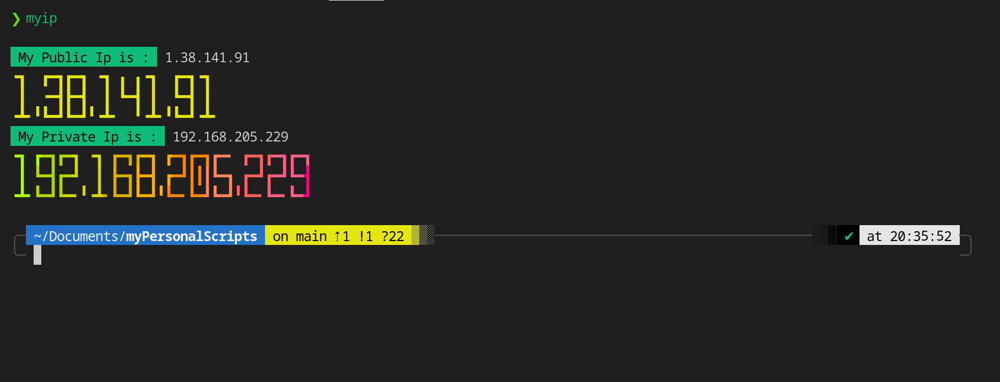
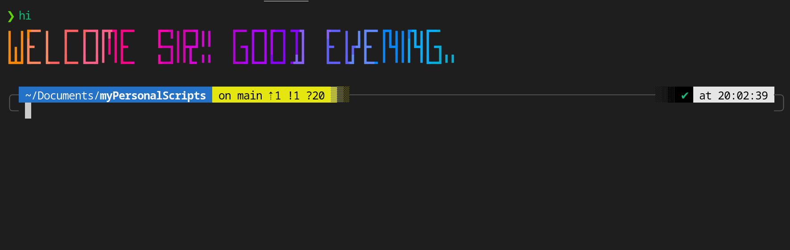
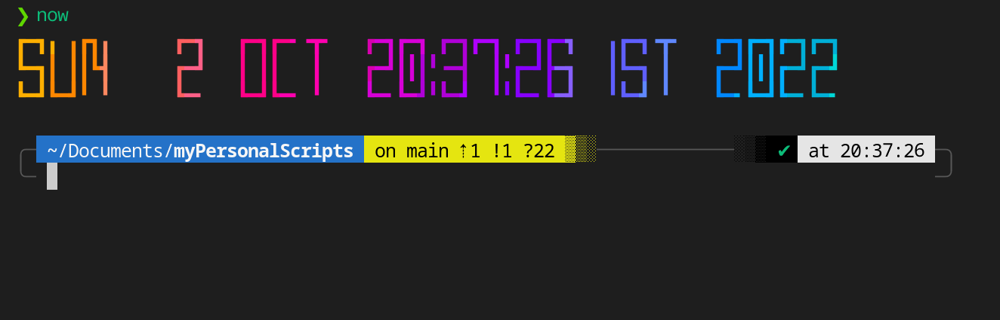
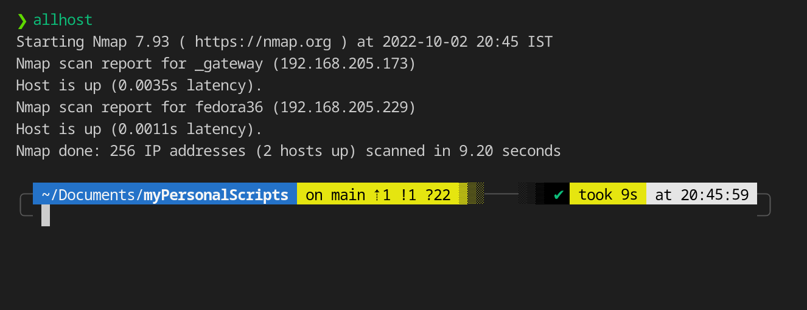
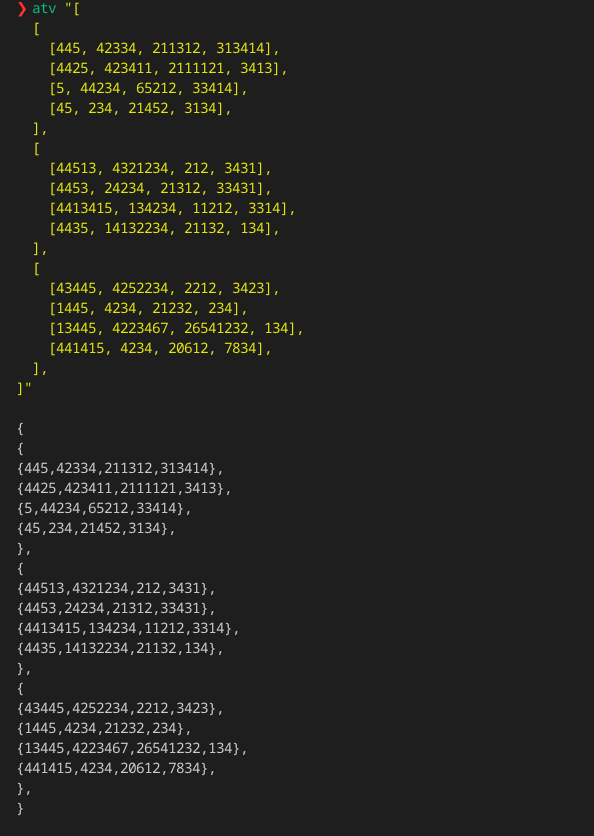

  

<!-- PROJECT LOGO -->
 

  
  
  <h3 align="center"><b>myPersonalScripts</b></h3>

  

    These are my personal scripts, created by me, which I use for productivity and performance. These utilities are multi purpose.
     
    <a href="#"><strong>Explore the docs »</strong></a>
     
     
    <a href="https://github.com/myPersonalScripts">View Demo</a>
    ·
    <a href="https://github.com/gv211432/myPersonalScripts/issues">Report Bug</a>
    ·
    <a href="https://github.com/gv211432/myPersonalScripts/issues">Request Feature</a>
  

<!-- ABOUT THE PROJECT -->

## ☑️ About The Project

**This is for linux users** 

Bash scripting allows a user to elegantly sequence commands together, as well as review commands to avoid potential havoc on data, files, and file structures. Style conventions in your scripts help the debugging process and enable fellow programmers to more easily read the code.

This project is developed by [me](https://github.com/gv211432)

In case if this documentation is big, please use find feature of browser for finding the specific part.
This documentation is for all the scripts above.

## ⚙️ Installation 

## 1. myip

This command is used for knowing your public and private IP address.

## 2. hi

This command wishes you as per the time. You can add this in your `bashrc` or `zchrc` for warm welcome by your temrminal on every login

## 3. now

Show the time in big and colorful font

## 4. allhost

This prints all the devices connected to the network you are connected to. This also prints the IP address of all the devices.

## 5. atv

Converts array(JavaScript, Python, etc) format to vector(C++) format. It get very annoying for manually addig editing the array again and again. This is usefull when you want to conver large array to vector.

## 6. keyfile

This is very useful when websites or application do'nt allow you for copy pasting stuffs. Just create any text file with any name and paste content in it. After giving the following command, your keyboard will start typing the same content. Just maintain the focus.

(<a href="#top">back to top</a>)

## 📖 License 

  [MIT](https://github.com/gv211432/myPersonalScripts/blob/main/LICENSE)
